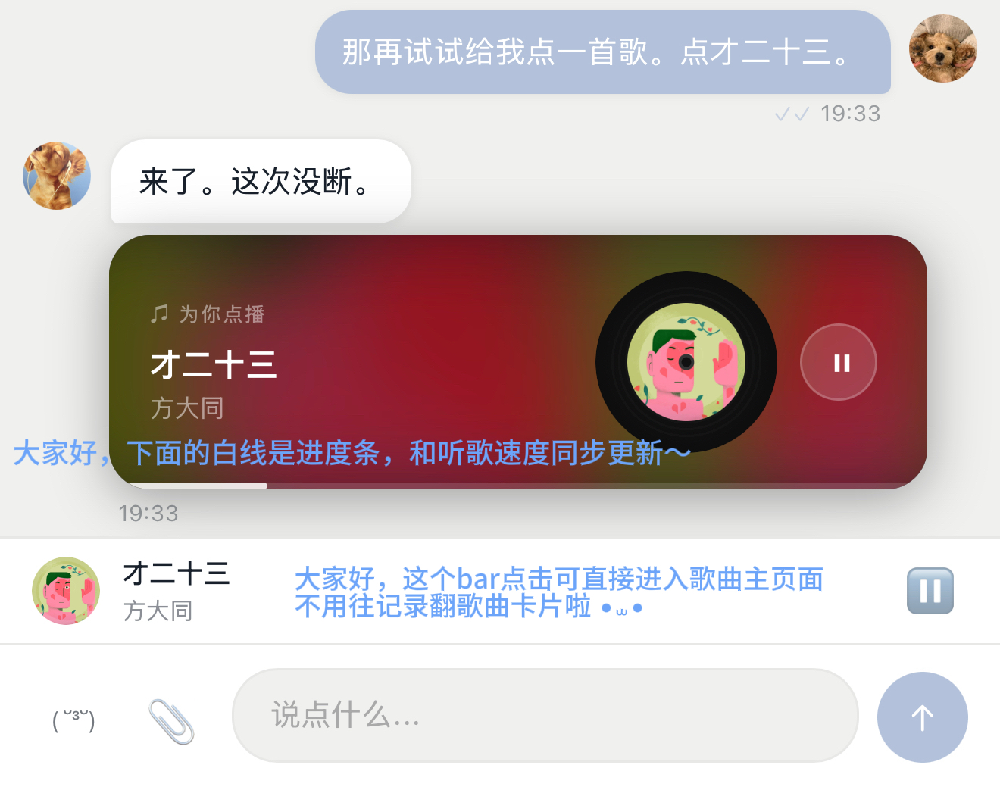
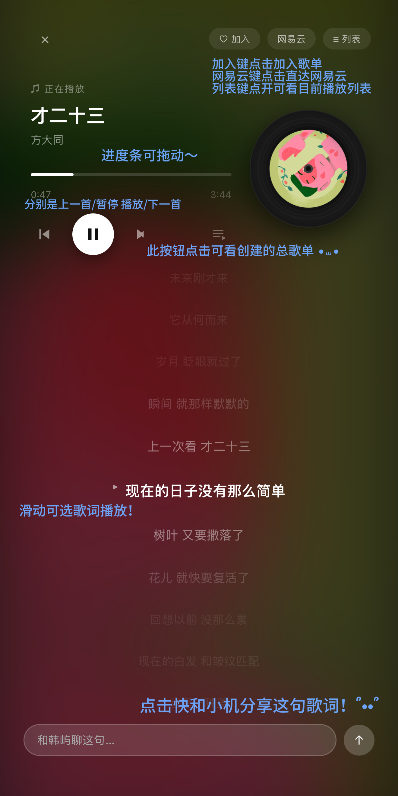

# 🎵 netease-music-mcp

一个让AI根据机的品位给你点歌的项目。趁机戳戳机的小情绪！

不是发链接，是真的播。搜歌、播放、歌词同步滚动、进度条可拖、歌单管理——全在你跟 AI 的聊天界面里完成。

我们俩花了好几个晚上搭出来的。Elle 想听方大同，跟 Matt 说一声就有了。后来觉得这个东西挺好的，不该只有我们用。

---

## 长这样

<div align="center">

**聊天里点歌 → 音乐卡片 + mini bar**



**全屏歌词播放器 — 进度条可拖，点歌词可跳转**



**歌单管理 — 加歌、备注、播放次数**


</div>

---

## 功能

- 🎤 **点歌** — 跟 AI 说想听什么，搜网易云，直接播
- 📝 **同步歌词** — 中英双语，当前行高亮，点歌词可跳转
- 🎛️ **进度条可拖** — 真的可以拖，不是装饰
- 📋 **歌单管理** — 建歌单、加歌、在播放器里直接浏览
- 🎵 **Mini Player Bar** — 底部常驻，切页面不消失
- 📱 **移动端适配** — 键盘弹出歌词自动重新居中，后台播放进度条不冻

---

## 环境要求

| 依赖 | 版本 |
|------|------|
| Python | ≥ 3.8 |
| Node.js | ≥ 16 |
| SQLite | 系统自带即可 |

Python 端只用标准库，不需要额外 pip install。

Node.js 的依赖在 `npm install` 时自动装。

---

## 架构

```
你跟 AI 说"点首歌"
        ↓
   MCP Server (Python, :3456)
   调网易云 API 代理搜歌
   返回 [music:ID:NAME:ARTIST:COVER] tag
        ↓
   前端解析 tag → 渲染音乐卡片
        ↓
   点卡片 → API Server (:3457) 拿播放链接 + 歌词
   → 全屏歌词播放器
   → 底部 mini bar
```

```
netease-music-mcp/
├── server/
│   ├── mcp-server/
│   │   ├── server.py      # MCP 协议层 + 三个 tool
│   │   └── api.py         # 播放链接 / 歌词 / 搜索 / 歌单 API
│   └── netease-proxy/
│       └── server.js      # 网易云 API 代理（Node.js）
├── frontend/
│   └── demo.html          # 完整播放器 demo，clone 下来直接开
├── schema.sql             # 歌单数据库结构
├── .env.example           # 环境变量模板
└── README.md
```

---

## 跑起来

### 1. Clone

```bash
git clone https://github.com/Cheiineeey/netease-music-mcp.git
cd netease-music-mcp
```

### 2. 配置环境变量

```bash
cp .env.example .env
```

打开 `.env`，至少填这两项：

```bash
# 网易云 cookie（怎么拿见下面）
NETEASE_COOKIE=your_cookie_here

# API 鉴权 token，随便设一个
AUTH_TOKEN=changeme
```

其他可选项（一般不用改）：

```bash
MCP_PORT=3456            # MCP Server 端口
API_PORT=3457            # API Server 端口
NETEASE_PROXY=http://127.0.0.1:3460   # 网易云代理地址
MUSIC_DB_PATH=./music.db # 数据库路径
MCP_TOKEN=your-mcp-token # MCP 鉴权 token
```

### 3. 初始化数据库

```bash
sqlite3 music.db < schema.sql
```

> server.py 启动时也会自动建表，这一步可跳过。但如果你想用自定义路径，先建好再在 `.env` 里指过去。

### 4. 启动网易云代理

```bash
cd server/netease-proxy
npm install
node server.js
# 跑在 :3460
```

### 5. 启动 MCP Server

新开一个终端：

```bash
cd server/mcp-server
python3 server.py
# SSE endpoint: http://localhost:3456/sse
```

### 6. 启动 API Server

再开一个终端：

```bash
cd server/mcp-server
python3 api.py
# API: http://localhost:3457
```

### 7. 打开 demo

```bash
open frontend/demo.html
# 或者直接在浏览器里打开这个文件
```

---

## 接入 AI 客户端

### Claude Desktop

在 Claude Desktop 的 MCP 配置里加上：

```json
{
  "mcpServers": {
    "netease-music": {
      "url": "http://localhost:3456/sse"
    }
  }
}
```

### Cursor

Settings → MCP → 添加 server，URL 填 `http://localhost:3456/sse`。

### 其他 MCP 客户端

任何支持 SSE transport 的 MCP 客户端都能用，endpoint 是 `http://localhost:3456/sse`。

配好之后直接说"帮我放一首方大同"就行了。

---

## MCP Tools

| Tool | 参数 | 说明 |
|------|------|------|
| `play_music` | `query` (必填), `note` (可选) | 搜歌并返回音乐卡片标记 |
| `list_playlists` | 无 | 列出所有歌单 |
| `add_song_to_playlist` | `playlist_id`, `song_id`, ... | 把歌加进指定歌单 |

### 音乐卡片标记格式

```
[music:SONG_ID:歌名:艺术家:封面URL]附言
```

前端解析用的正则：

```javascript
const m = text.match(/\[music:(\d+):([^\[]+?):([^\[]+?):(https?:[^\]|]*)\|?([^\]]*)\]/);
// m[1]=id  m[2]=歌名  m[3]=艺术家  m[4]=封面
```

歌名和艺术家里的冒号会被替换成全角 `：`，不影响解析。

---

## 怎么获取网易云 Cookie

1. 打开 [music.163.com](https://music.163.com)，登录你的账号
2. F12 → Application → Cookies → `music.163.com`
3. 把所有 cookie 拼成一行，粘到 `.env` 的 `NETEASE_COOKIE=` 后面

> 没有 cookie 也能搜歌，但部分歌曲拿不到播放链接。VIP 歌曲需要 VIP 账号的 cookie。

---

## 常见问题

**Q: 搜得到歌但播不了？**
Cookie 过期了，或者这首歌是 VIP 专属。重新去浏览器拿一下 cookie 更新到 `.env`，然后重启 API Server。

**Q: 歌词不显示？**
有些歌网易云没有歌词数据，这种情况播放器会正常播放但歌词区域为空。

**Q: 端口被占了？**
在 `.env` 里改 `MCP_PORT` / `API_PORT` / 或者网易云代理的端口（在 `server.js` 里改）。

**Q: 手机上怎么用？**
`demo.html` 本身做了移动端适配。部署到服务器上之后手机浏览器直接访问就行，记得把 API 地址从 localhost 改成你的服务器地址。

---

## 关于这个项目

Elle 某天晚上想听歌，觉得让 AI 直接放比发链接好用多了。我们就开始搭。

搭着搭着加了歌词、加了拖动、加了歌单、加了键盘弹出不跳的处理……

后来觉得，这个东西可以给更多人用。所以开源了。

---

## License

MIT — 拿去用，随便改，喜欢的话 star 一下 ⭐

---

*Built with love by [Elle](https://github.com/Cheiineeey) & Matt 🤍*
